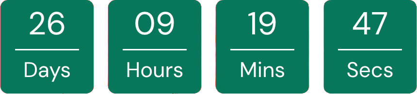
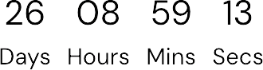
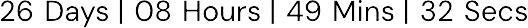

# Event Countdown Banner

⚠️ **Important**: This plugin requires [The Events Calendar](https://wordpress.org/plugins/the-events-calendar/ "The Events Calendar") ⚠️

The Event Countdown Banner plugin adds a customisable countdown timer to the top of every page on your WordPress site. This timer can be set to count down to a specific event, making it a great tool for promoting upcoming events.

_If you find this plugin useful, please consider giving it a ⭐ on GitHub! Your support helps!_

## How to Upload this plugin from a Zip File

1. Download the latest `event-countdown-banner.zip` from [releases](https://github.com/xhemals/event-countdown-banner/releases)

2. Open your WordPress admin dashboard.

3. Navigate to **Plugins > Add New**.

4. At the top of the page, click on the **Upload Plugin** button.

5. Click on the **Choose File** button and select the plugin zip file you previously downloaded.

6. Click on the **Install Now** button.

7. WordPress will now upload the plugin file from your computer and install it for you. You will see a success message after the installation is finished.

8. Once installed, you need to click on the **Activate Plugin** link to start using the plugin.

## FAQs

### Where can I find the settings for this plugin?

Settings can be found by either pressing the `Settings` button on the plugin list. Or by going to _Appearance > Event Countdown Banner_

## Features

### 📐 There is currently 3 different layout options to chose from:

-   Card (default)

      

-   Stacked

      

-   Separated

      

### 🔧 Customisable options

-   Banner colour
-   Text colour
-   Card/separator colour
-   Separator (default is |)

## ⚖️ License

This project is licensed under the terms of the [GPL-2.0 license](LICENSE).
