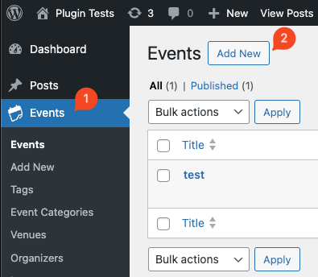
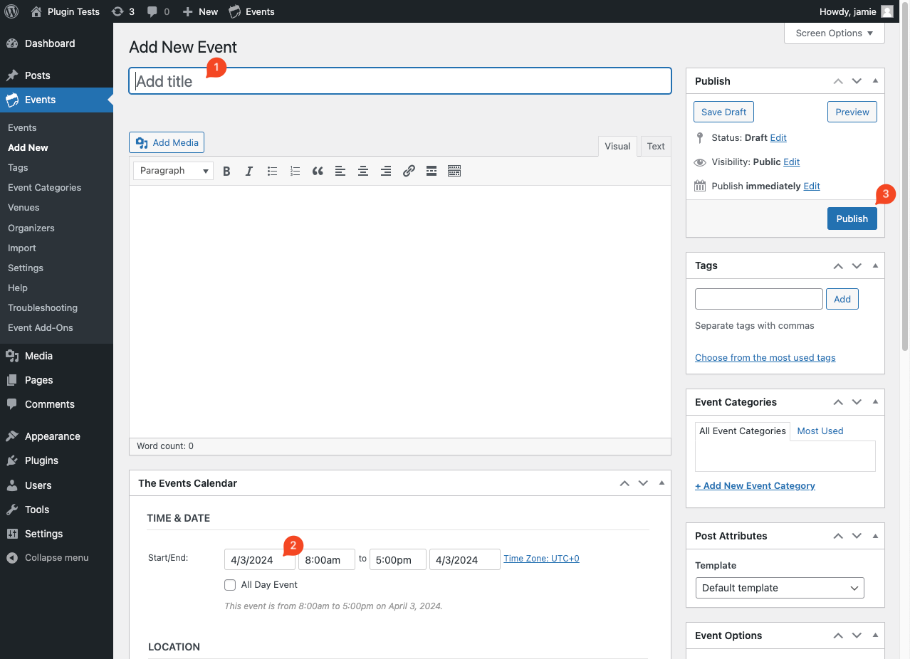

# Create A New Event

For this plugin to function correctly you need to create a new event. This guide assumes you have already installed and activated [The Events Calendar](https://wordpress.org/plugins/the-events-calendar/).

The steps to do this are as follows:

1. In your WordPress admin panel, go to _Events > Add New_

    

2. Give you event a title, start date and publish

    - I reccomend setting the start date to at least a few days from now so it doesn't expire, as the banner will automatically hide if it does

    
